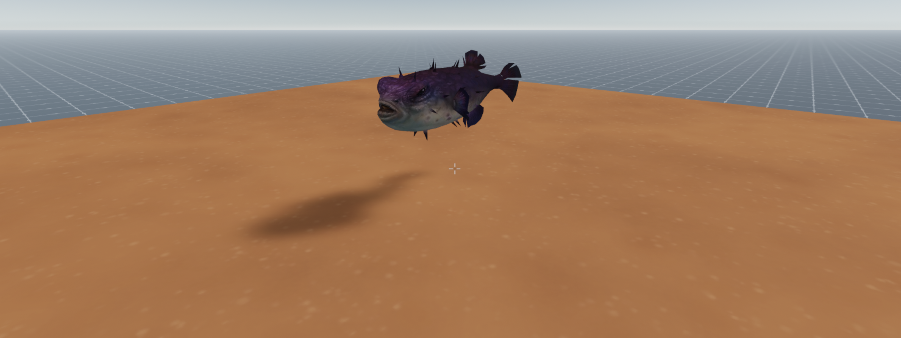

## Puffer fish

A simple interactive scene with a puffer fish that blows up when clicked.

- Use the utils helper library to scale an entity and delay actions
- Adding sound to an entity





[Explore the scene](https://puffer.decentraland1.now.sh/?position=-132,-40): this link takes you to a copy of the scene deployed to a remote server where you can interact with it just as if you were running `dcl start` locally.

**Install the CLI**

Download and install the Decentraland CLI by running the following command

```bash
npm i -g decentraland
```

For a more details, follow the steps in the [Installation guide](https://docs.decentraland.org/documentation/installation-guide/).


**Previewing the scene**

Once you've installed the CLI, download this example and navigate to its directory from your terminal or command prompt.

_from the scene directory:_

```
$:  dcl start
```

Any dependencies are installed and then the CLI will open the scene in a new browser tab automatically.

**Usage**

Click on the fish and it will puff up and then deflate.

Learn more about how to build your own scenes in our [documentation](https://docs.decentraland.org/) site.

## Copyright info

This scene is protected with a standard Apache 2 licence. See the terms and conditions in the [LICENSE](/LICENSE) file.

3D model from Sketchfab user Konta Johanna
https://poly.google.com/view/1RET-GHtITG
Soudn file from FreeSound user Terhen
https://freesound.org/people/Terhen/sounds/234187/
Both with creative commons licenses.